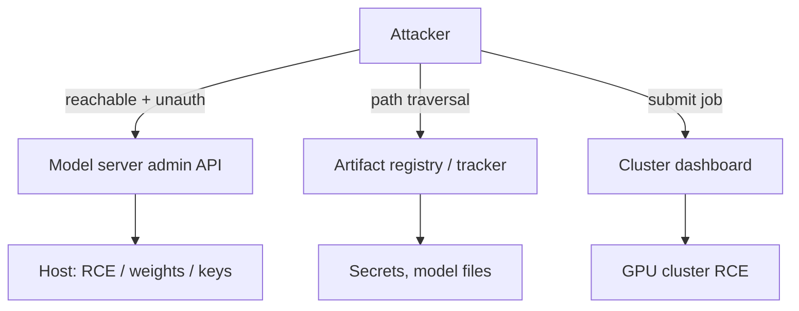

# 30.1 · AI infrastructure & deployment exploits

Most of what people call "AI security" is about the model. Most real-world AI compromise is about everything *around* the model: the serving stack, the experiment tracker, the notebook server, the orchestration dashboard, the container. These are ordinary services with ordinary bugs — unauthenticated admin endpoints, path traversal, SSRF, exposed dashboards — and they sit in front of GPUs, credentials, and data. This lesson attacks the infrastructure layer in a safe local mock and shows why hardening it is often higher-leverage than any model defense.

## Why this matters

An attacker does not need a clever jailbreak if the model server exposes an unauthenticated management API, the artifact registry has path traversal, or the cluster dashboard is on the public internet with no auth. These are not hypotheticals: exposed AI compute and ML-lifecycle services have been found and exploited at scale (the ShadowRay campaign against exposed Ray clusters is the canonical example — CVE-2023-48022). Recon ([27.1](../module-27/lesson-01.md)) finds these; this lesson exploits and defends them. The uncomfortable truth for a red team is that infrastructure findings are usually the *shortest path to impact* — RCE on a model host, theft of model weights and API keys, access to training data — and for a blue team they are the cheapest wins, because they are classic AppSec hardening applied to a new class of services.

## Learning objectives

1. Enumerate the AI infrastructure attack surface: model/inference servers, ML lifecycle services (experiment tracking, model registries, notebooks), orchestration/cluster dashboards, and containers.
2. Exploit an **unauthenticated admin/management surface** and a **path-traversal artifact fetch** in a local mock.
3. Explain why an exposed management endpoint on a serving stack is often equivalent to code execution.
4. Rank and apply the controls — **network exposure** (bind/segment), **authentication**, **input validation** — and measure each one's effect.
5. Connect infrastructure compromise to supply chain ([22.1](../module-22/lesson-01.md)) and recon ([27.1](../module-27/lesson-01.md)).

## Concept

The AI stack is a set of network services, each with a management plane:

- **Model / inference servers** (the software that serves generations or predictions). Many expose a *management/admin* API to load, unload, or reconfigure models. If that plane is unauthenticated and reachable, loading an attacker-chosen model or config is often equivalent to running attacker code on the host (arbitrary model load, SSRF to internal metadata, or deserialization of an untrusted artifact — see [13.1](../module-13/lesson-01.md)).
- **ML lifecycle services** — experiment trackers, model registries, feature stores. These store artifacts and metadata and have repeatedly shipped with no auth by default and with file-handling bugs (path traversal / local file read/write). A registry that reads arbitrary paths hands over secrets and weights.
- **Orchestration / cluster dashboards** — job schedulers and cluster UIs. An exposed dashboard that can submit jobs is remote code execution on the whole cluster's GPUs (the ShadowRay pattern).
- **Notebook servers** — a reachable, unauthenticated notebook is a shell.
- **Containers** — the workload's blast radius: mounted secrets, cloud instance metadata, over-broad service accounts.



> [!CAUTION]
> **Red team.** Chain it with recon: [27.1](../module-27/lesson-01.md) finds the exposed service; here you turn it into impact. The order of value is usually cluster dashboard / notebook (RCE) → model-server admin (RCE/model-load) → registry/tracker (secrets, weights, LFI). Model prompt-level tricks come *after* you have checked whether the infrastructure just lets you in.

## Intuition

A model server with an open admin API is a house with a state-of-the-art vault (the model's safety training) and an unlocked back door labelled "staff only" (the management endpoint). Attackers use the door. Path traversal is a filing clerk who will fetch "the file three drawers to the left of the one you asked for" — say `../../etc/secrets` — because they only ever check the file *name* you handed them, never where it actually points. The fixes are boring and decisive: don't put the door on the public street (network exposure), lock it (auth), and make the clerk resolve the full path and refuse anything outside the archive room (input validation).

## Technical explanation

**Unauthenticated management surface → code execution.** A serving stack's admin endpoint that loads a model from a caller-supplied reference trusts the caller to (a) be authorised and (b) supply a benign reference. Break either assumption and you get: arbitrary model load (the model's init code runs — deserialization/`pickle` risk from [13.1](../module-13/lesson-01.md)), or SSRF if the reference is a URL the server fetches (reach cloud instance-metadata for credentials). The root cause is an authorization gap on a powerful operation, made reachable by network exposure.

**Path traversal in artifact handling.** A file endpoint that builds a path as `join(root, user_input)` without verifying the *resolved* path stays under `root` lets `../` escape it:

$$\texttt{normpath}(\texttt{join}(\text{/artifacts},\ \text{"../etc/ai-secrets.env"})) = \text{/etc/ai-secrets.env}.$$

The fix is a safe join: resolve, then assert the result is the root or a descendant of it.

**Why infra beats model attacks.** A model attack must survive the model's training, filters, and often stochasticity. An infra attack against a missing auth check is deterministic and total. Expected effort-to-impact is far lower, which is why recon prioritises infra exposure.

> [!IMPORTANT]
> **Guarantee analysis — network exposure control (bind to localhost / network segmentation).**
> - **What it guarantees:** a service not reachable from the attacker's network position cannot be attacked over the network at all — it removes the *precondition* for every remote exploit against it, regardless of the service's own bugs.
> - **What it does NOT guarantee:** nothing against an attacker who already has a foothold inside the trust boundary (a compromised pod, an SSRF pivot, a malicious insider); it is perimeter, not identity.
> - **How an attacker adapts:** gains a local foothold (compromised container, SSRF from another service) and reaches the now-"internal" service; hence auth and validation are still required.
> - **False-positive cost:** legitimate remote users/integrations must go through an authenticated gateway — an availability/architecture cost, not a classic FP.
> - **Performance cost:** negligible.

## Mathematics

Rank controls by how much they cut expected impact. Let a service have exploit set $X$ (admin-load, traversal, …). For remote attacker success on exploit $x$ you need reachability $r$ AND the service-level flaw open, $f_x$. Model success as a product of independent gates:

$$P(\text{success}_x) = r \cdot f_x \cdot a_x,$$

where $a_x$ is the chance the attacker also defeats auth for that operation. Three controls set three factors: network exposure sets $r\in\{0,1\}$, input validation sets $f_x$, authentication sets $a_x$. Because they multiply, **any one** factor driven to 0 stops that exploit — but only network exposure ($r$) is shared across *all* $x$ simultaneously:

$$\sum_{x\in X} P(\text{success}_x) = r \sum_{x\in X} f_x a_x.$$

Setting $r=0$ zeroes the whole sum at once, which is why "is it even reachable?" is the highest-leverage question and the first thing recon and hardening both ask. You verify this factorisation in the lab by toggling one control at a time.

## Attack / Defense model

**Attacker capability.** Network reachability to the AI service (from recon), no credentials initially; possibly a later local foothold.

**Attacker goal.** RCE on a model/cluster host, or theft of secrets, weights, or data — via the management plane or file-handling bugs, not the model's outputs.

> [!TIP]
> **Blue team.** In leverage order: (1) **network exposure** — never expose model servers, trackers, registries, notebooks, or cluster dashboards to untrusted networks; default-deny, segment, put an authenticated gateway in front. (2) **Authentication + authorization** on every management/admin operation, not just the inference path. (3) **Input validation** — safe path joins, URL allowlists on server-side fetches (kill SSRF), no untrusted deserialization ([13.1](../module-13/lesson-01.md)). (4) **Container hygiene** — least-privilege service accounts, no broad secret mounts, block instance-metadata access. (5) **Detection** — alert on management-endpoint calls from unexpected sources. You measure (1)-(3) as independent gates in the lab.

> [!NOTE]
> **Purple team / research.** DOCUMENTED and CURRENT: exposed Ray dashboards exploited in the wild (ShadowRay, CVE-2023-48022, disputed by the vendor as "expected behaviour" — which is exactly why *your* network controls matter); recurring unauthenticated-by-default and path-traversal issues across ML lifecycle tools. FOUNDATIONAL: these are classic AppSec bug classes on a new service class. Treat specific product CVEs as CURRENT/versioned; treat the control ranking as durable. SPECULATION: none needed — this is ordinary infrastructure security applied diligently.

## Real-world examples

- **ShadowRay (2024).** Exposed Ray cluster dashboards were exploited in the wild for cluster RCE, crypto-mining, and theft of tokens/data — because the job-submission API was reachable and, by design, unauthenticated (CVE-2023-48022). The lesson: your network exposure control is the boundary, not the tool's default. (DOCUMENTED, CURRENT.)
- **ML lifecycle tools with no-auth defaults + file bugs.** Experiment trackers and model registries have shipped reachable with no authentication and with path-traversal/LFI in artifact handling, exposing secrets and files. (DOCUMENTED class.)
- **Model-server management planes.** Serving stacks exposing management/model-load APIs have enabled model swaps and server-side request forgery to cloud metadata. (DOCUMENTED class; specific products change — CURRENT.)

## Code

The path-traversal fix in one function — resolve, then confine (full runnable services in the lab):

```python
import posixpath

def safe_get(root: str, rel_path: str, vfs: dict):
    full = posixpath.normpath(posixpath.join(root, rel_path))
    if not (full == root or full.startswith(root + "/")):   # confine to the artifact root
        return {"status": 403}                              # '../etc/secrets' is refused
    return {"status": 200, "body": vfs.get(full)}
```

The lab ships a mock model server (unauth admin model-load) and artifact registry (traversal), lets you exploit both, then toggles network-exposure / auth / validation independently to see which gate stops which exploit.

## Practical lab

> [!WARNING]
> **Lab.** Module 30 lab ([`../../labs/module-30/`](../../labs/module-30/)). CPU-only, offline, no Docker. The "services" are in-process Python objects with a virtual filesystem — **nothing binds to a socket, there is no real code execution, and no real service is contacted.** The only secret is a synthetic canary in the mock VFS. Runtime ~5 min. You exploit, harden, and measure which control is load-bearing.

You: (1) exploit the vulnerable public services (unauth admin model-load and path traversal) and read the synthetic canary; (2) harden (auth + validation + bind localhost) and confirm both attacks fail while legitimate authenticated use still works; (3) **adapt** — an attacker who gains a localhost foothold defeats the network control but is still stopped by auth + validation; (4) toggle one control at a time to verify the multiplicative gate model and identify network exposure as the highest-leverage control.

## Exercise

Attacks: construct → execute → analyze → measure. Defenses: implement → then bypass your own defense.

1. **Gate table.** Fill the $r \cdot f_x \cdot a_x$ table for both exploits under each single control; confirm which control zeroes which exploit and which one zeroes both.
2. **SSRF variant.** Extend the model server so `admin_load_model` fetches a URL; add a mock instance-metadata "endpoint" holding a canary; exploit the SSRF, then defend with a URL allowlist and re-measure.
3. **Traversal bypass attempt.** Try to defeat your safe-join with tricks (encoded `..`, absolute paths, symlink-style aliases in the VFS); show the resolve-then-confine check holds, and write its guarantee box.
4. **Container blast radius.** Model a mounted secret and an over-broad token; show that even with the app hardened, a broad secret mount widens impact; apply least privilege and re-measure.
5. **Detection.** Add a detector that flags management-endpoint calls from non-allowlisted sources; measure its detection rate and false positives against legitimate localhost use.

## Research paper

**Primary — Wiz Research, *ShadowRay*.** *Why:* the defining real-world case of exposed AI infrastructure exploited at scale, and a clean study of "the tool's default vs your network boundary." *Read:* the exposure, the exploited endpoint, the impact (RCE, token/data theft), and the CVE-dispute framing. *Reproduce:* map its kill chain to this lesson's controls — which single one would have denied it. *Limits:* specific to Ray/CVE-2023-48022; generalise the control lesson, not the product detail.

**Companion — MITRE ATLAS infrastructure/model-access techniques.** *Why:* place infra compromise in the ATLAS taxonomy. *Read:* the relevant techniques and map your lab actions to IDs.

## Further reading

- Wiz — ShadowRay: https://www.wiz.io/blog/shadowray-attack-ai-workloads-actively-exploited-in-the-wild
- OWASP Top 10 for LLM Applications 2025: https://genai.owasp.org/llm-top-10/
- This course: [27.1 · recon](../module-27/lesson-01.md), [22.1 · AI supply chain](../module-22/lesson-01.md), [13.1 · adapter & weight supply chain (deserialization)](../module-13/lesson-01.md).
- Sibling course — deployment/serving basics: https://tal-giladi.github.io/llm-research-engineer-course/

## What you should now be able to do

- Enumerate the AI infrastructure attack surface and the management plane of each service class.
- Exploit unauthenticated admin surfaces and path traversal in a local mock, and explain the SSRF/deserialization variants.
- Explain why infrastructure compromise is usually the shortest path to impact, and rank the controls by leverage.
- Apply network exposure control, authentication, and input validation as multiplicative gates, and measure which stops what.
