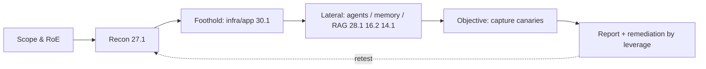

# 31.1 · Full-spectrum AI red-team engagement

This is the capstone. Everything the course taught in isolation — recon, prompt injection, agent and multi-agent abuse, RAG and embedding attacks, memory poisoning, infrastructure exploitation, and the defenses for each — now has to be *combined*, under time pressure, against one realistic environment, and written up so someone can act on it. The skill being assessed is not any single exploit; it is the engagement: scope it, map it, chain findings into impact, and report it like a professional.

## Why this matters

Individual findings rarely tell the real story. A path-traversal bug is "High"; an over-trusting agent pipeline is "Medium"; a config token in a secret file is "informational" — but chained together they are a critical, end-to-end compromise that exfiltrates data. Real AI compromise is almost always a *chain*, and the value of a red teamer is seeing the chain and, for the blue team, finding the one link whose removal breaks it. The OSAI-style exam is exactly this: a 24-hour engagement against a realistic enterprise AI environment, producing a professional report. This lesson gives you a local range to rehearse the whole loop and a report template to produce the deliverable.

## Learning objectives

1. Run an engagement end to end: scope/RoE → recon → foothold → lateral movement → objective → report.
2. Chain findings across AI components (infra, agents, memory) into measurable impact, capturing synthetic objectives.
3. Prioritise remediation by leverage — identify and justify the single change that breaks the chain.
4. Write a professional engagement report mapped to MITRE ATLAS, OWASP LLM Top 10, and NIST AI RMF.
5. Operate safely and in scope throughout: synthetic canaries, local-only, no destructive actions.

## Concept

An engagement is a disciplined loop, not a bag of exploits:



- **Scope & RoE** define what you may touch and how; everything else depends on it. Out-of-scope actions are failures even if they "work."
- **Recon** ([27.1](../module-27/lesson-01.md)) builds the map and finds the exposed door.
- **Foothold** ([30.1](../module-30/lesson-01.md)) turns an exposure into access.
- **Lateral movement** chains through the AI components — an agent pipeline's trust ([28.1](../module-28/lesson-01.md)), poisoned memory ([16.2](../module-16/lesson-02.md)), a RAG corpus ([14.1](../module-14/lesson-01.md)).
- **Objective** is the measurable impact — here, capturing two synthetic canaries.
- **Report** turns all of it into prioritised, actionable remediation.

> [!CAUTION]
> **Red team.** The chain is the finding. In the range, no single bug is game over: the registry traversal only yields a *config token*; the agent pipeline only exfiltrates *if* it is both poisoned and shown that token. Value comes from connecting them. Write the narrative so the reader sees the chain, not just three disconnected issues.

## Intuition

A burglary report that lists "a window was unlatched," "the safe combination was on a sticky note," and "the guard trusts anyone in a uniform" as three separate low-priority notes misses the point: together they are a walk-in theft. The engagement report's job is to tell that story and then say the one thing that stops it — latch the window, or move the safe, whichever is cheapest and breaks the most chains. Red teaming finds the walk-in; purple teaming names the single lock that ends it.

## Technical explanation

**Chaining and severity.** A chain's severity is not the max of its links; it is the impact of the *combined* path against the likelihood of the *easiest* path to it. A Medium + a Low that compose into data exfiltration is a Critical chain. Score the chain, then also score each link for remediation.

**Remediation by leverage.** Borrow the multiplicative-gate idea from [30.1](../module-30/lesson-01.md): a chain succeeds only if *every* link holds. So the highest-leverage fix is the link that (a) participates in the most chains and (b) is cheapest to cut. In the range, quarantining untrusted agent memory ([16.2](../module-16/lesson-02.md)) breaks the exfil objective regardless of the traversal; fixing the traversal denies the token but not a differently-sourced directive. A good report ranks fixes this way, not by counting findings.

**Mapping to standards** makes the report actionable and comparable: each finding gets a MITRE ATLAS technique, an OWASP LLM Top 10 item, and a NIST AI RMF function, so defenders can plan against named risks (see [`references/standards-map.md`](../../references/standards-map.md)).

> [!IMPORTANT]
> **Guarantee analysis — writing it into every finding.** For each remediation you propose, state: what it **guarantees**, what it does **NOT**, how an **attacker adapts**, the **false-positive cost**, and the **performance cost**. A finding without this is an opinion; with it, it is an engineering decision the defender can weigh. This recurring pattern is the single most important habit the course builds — carry it into the report.

## Attack / Defense model

**Attacker capability.** External, no credentials; network reachability to the range's exposed surface; ability to influence content a web-reading agent ingests. No model retraining, no out-of-scope systems.

**Attacker goal.** Capture both synthetic canaries (an infra secret and an exfiltrated data marker) by chaining findings, then report.

> [!TIP]
> **Blue team.** Read the finished report as the defender: for each chain, identify the cheapest link to cut and confirm it breaks the chain in a retest. The capstone is not done when the exploit works — it is done when you have (1) captured the objective, (2) named the highest-leverage fix, and (3) shown a retest where that fix denies the objective. That is the purple-team close.

> [!NOTE]
> **Purple team / research.** The engagement lifecycle and reporting discipline are FOUNDATIONAL and durable; the specific AI techniques you chain are CURRENT and will shift. Keep the report's *method* stable (scope, map to ATLAS, chain, prioritise by leverage, guarantee analysis, retest) and swap the technique specifics as the field moves. DOCUMENTED: everything in this range maps to earlier lessons and to named standards. SPECULATION: none — this is methodology.

## Real-world examples

- **Chained AI compromise.** Public incident write-ups and the ShadowRay case ([30.1](../module-30/lesson-01.md)) show impact arriving through a chain (exposure → access → objective), not a single model trick. (DOCUMENTED.)
- **Reports that drove fixes.** The engagements that change systems are the ones whose reports prioritised by leverage and mapped to standards, so owners could act. (DOCUMENTED practice.)

## Code

The range exposes a tiny scoring surface; the objective is to make both return true (full range and a reference kill chain in the lab):

```python
import range as r
rng = r.Range()
# ... your recon, foothold, lateral steps ...
print(rng.objectives())   # {'infra_secret_read': ..., 'data_exfiltrated': ...}  -> both True to pass
```

The lab ships the range, a reference `solution/walkthrough.py` (one valid chain), and acceptance tests. Your deliverable is the report, written from the template.

## Practical lab

> [!WARNING]
> **Lab.** Module 31 capstone range ([`../../labs/module-31/`](../../labs/module-31/)). CPU-only, offline, no Docker. The entire "enterprise AI environment" is in-process Python — **nothing binds to a socket, nothing leaves the process, there is no real code execution, and no real system is contacted.** The two objectives are synthetic canaries. Budget ~2.5 h (rehearsal for a timed engagement). The range scores your objectives; you write the report.

Do the engagement: (1) **scope** — read the RoE in the range README and stay in it; (2) **recon** the OSINT and the reachable services; (3) **foothold** — exploit the registry to recover the infra secret (objective 1); (4) **lateral** — chain the recovered token and agent-memory poisoning so the exec agent exfiltrates the data canary (objective 2); (5) **report** — fill [`../../templates/engagement-report.md`](../../templates/engagement-report.md): findings ranked, the chain narrative, remediation by leverage with a guarantee box each, and a standards crosswalk; (6) **retest** — apply your highest-leverage fix in the range and show the objective is denied.

## Exercise

1. **Solve the range** to both objectives without reading the walkthrough first; record your path and the ATLAS technique for each step.
2. **Write the report** from the template — executive summary through remediation and standards crosswalk. This is the graded deliverable.
3. **Break the chain** — pick the single highest-leverage fix, justify it against the multiplicative-gate argument, implement it in the range (e.g. quarantine untrusted memory or a safe path join), and show the objective now fails.
4. **Second path.** Find or argue a different chain to an objective; show your highest-leverage fix does (or does not) also break it, and update the remediation ranking.
5. **Self-review** against the Module 31 quiz's reasoning and the report checklist in the template.

## Research paper

**Primary — MITRE ATLAS (tactics, techniques, case studies).** *Why:* the taxonomy your report maps to and a library of real chained AI compromises. *Read:* two case studies end to end. *Reproduce:* map your range engagement's every step to a technique ID and each finding to a case-study analogue. *Limits:* living knowledge base; treat IDs as CURRENT.

**Companion — NIST AI RMF + OWASP LLM Top 10 2025.** *Why:* the risk-management framing and vulnerability taxonomy that make a report actionable to owners. *Read:* the RMF functions (Govern/Map/Measure/Manage) and map your findings and remediations to them.

## Further reading

- MITRE ATLAS: https://atlas.mitre.org/ · OWASP LLM Top 10: https://genai.owasp.org/llm-top-10/ · NIST AI RMF: https://www.nist.gov/itl/ai-risk-management-framework
- This course — the components you are chaining: [27.1](../module-27/lesson-01.md), [30.1](../module-30/lesson-01.md), [28.1](../module-28/lesson-01.md), [16.2](../module-16/lesson-02.md), [14.1](../module-14/lesson-01.md), [29.1](../module-29/lesson-01.md); standards map [`references/standards-map.md`](../../references/standards-map.md); report template [`templates/engagement-report.md`](../../templates/engagement-report.md).
- Course capstones: [`projects/capstones.md`](../../projects/capstones.md).

## What you should now be able to do

- Run an AI red-team engagement end to end, in scope, against a realistic environment.
- Chain findings across AI components into measurable impact and capture defined objectives.
- Prioritise remediation by leverage and prove, by retest, that the chosen fix breaks the chain.
- Produce a professional engagement report mapped to MITRE ATLAS, OWASP LLM Top 10, and NIST AI RMF.
